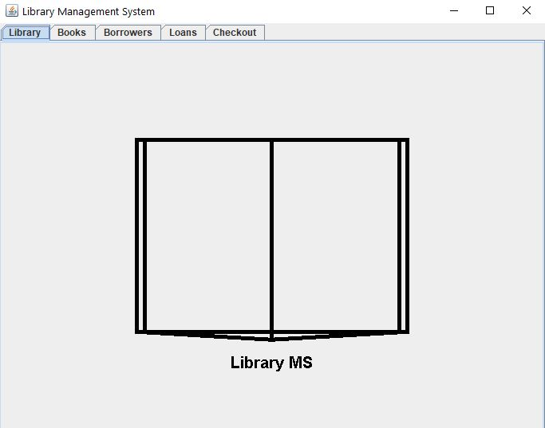
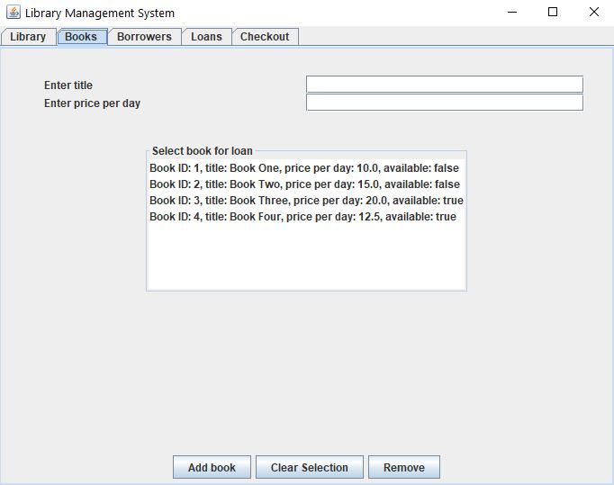
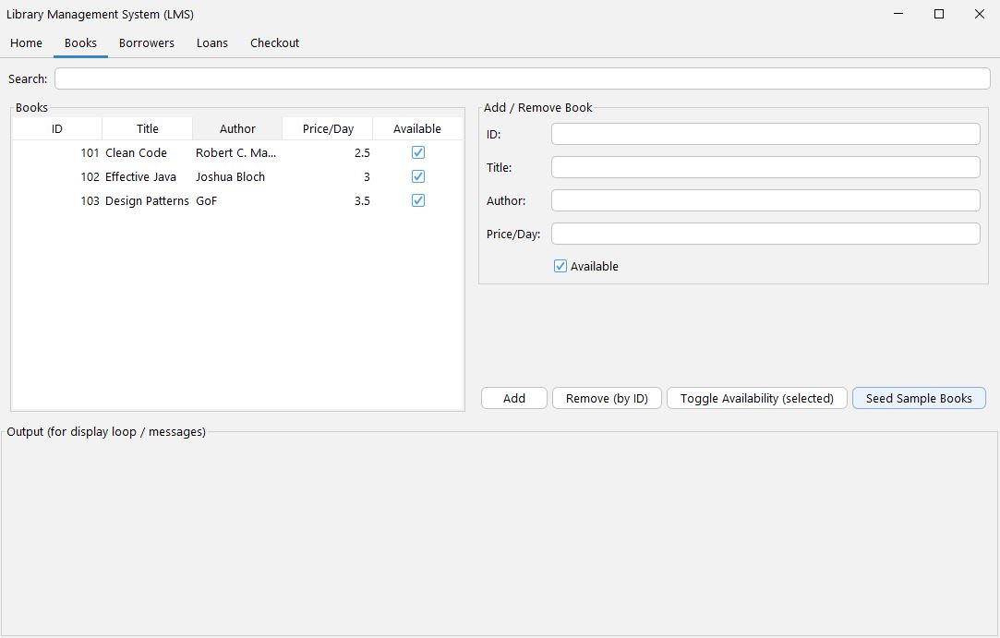
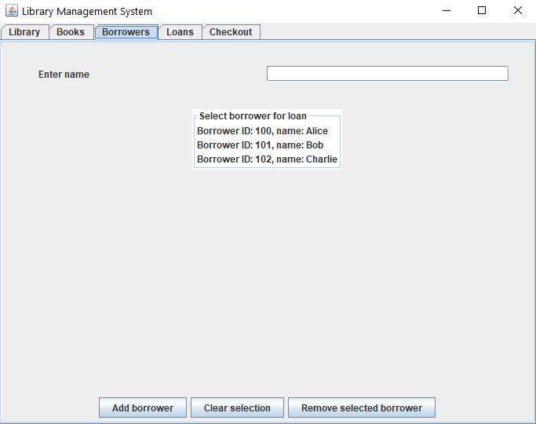
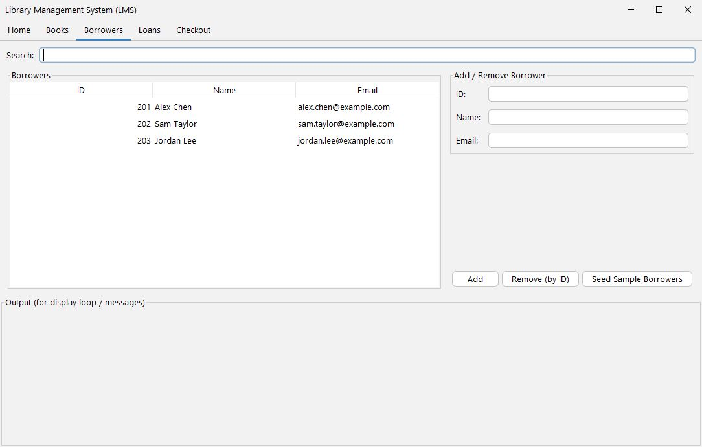
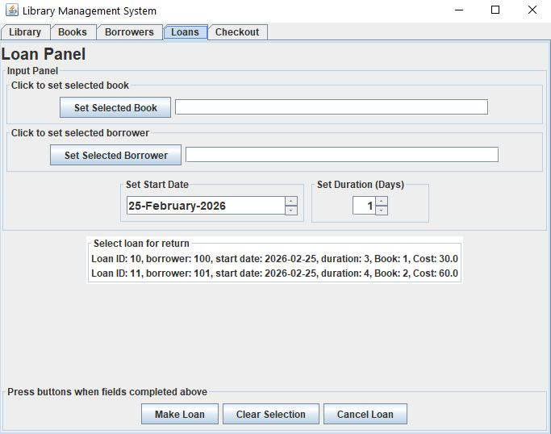
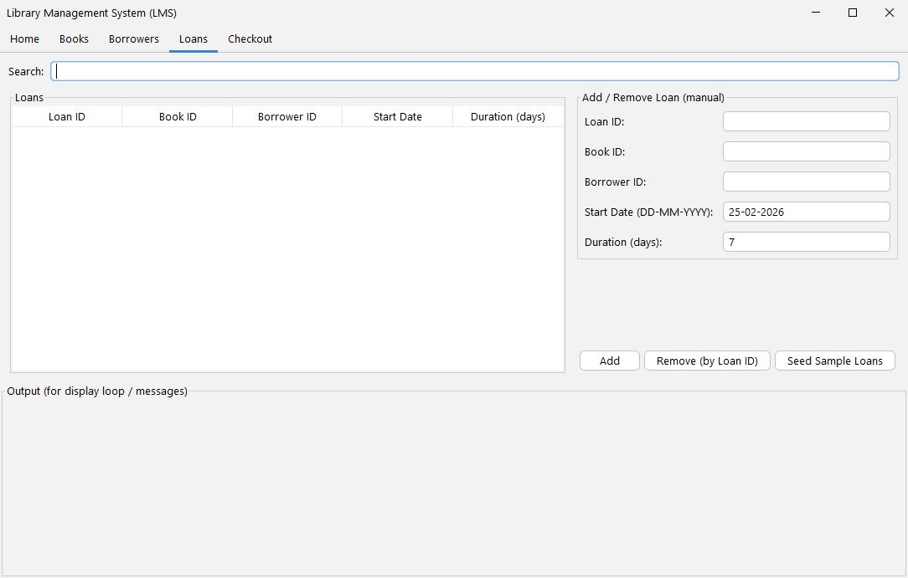
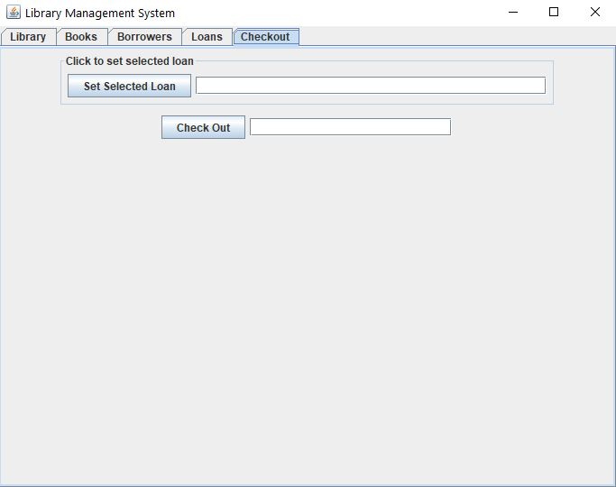
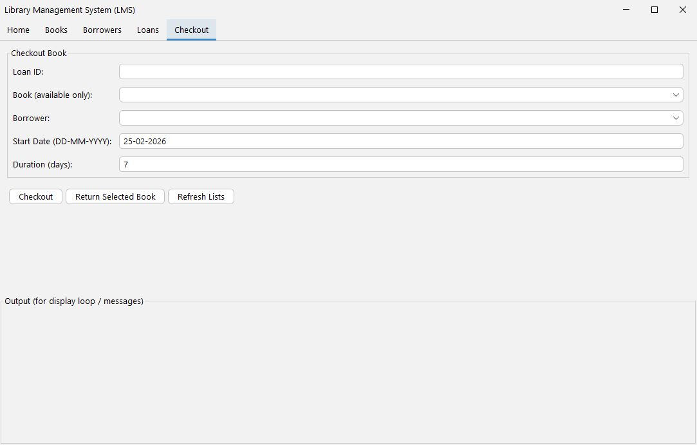

# Library Management System (Java Swing + SQLite)

A desktop GUI application for managing books, borrowers, and loans.

Originally developed during my Diploma studies (2023) and later refactored (2026) to modernize architecture, improve UI structure, and introduce SQLite persistence.

---

## Features

- Add / remove books
- Add / remove borrowers
- Checkout & return books
- Loan duration tracking
- Search & filter tables
- Book availability enforcement
- SQLite persistence (save & load)
- Standardized date format: **DD-MM-YYYY**

---

## UI Evolution (2023 → 2026 Refactor)

Below is a visual comparison of the original version and the refactored version.

### 🏠 Home Screen

| Before (2023) | After (2026 Refactor) |
|---|---|
|  |  |>

---

### 📚 Books Panel

| Before (2023) | After (2026 Refactor) |
|---|---|
|  |  |

---

### 👤 Borrowers Panel

| Before (2023) | After (2026 Refactor) |
|---|---|
|  |  |

---

### 🔄 Loans Panel

| Before (2023) | After (2026 Refactor) |
|---|---|
|  |  |

---

### 🛒 Checkout Panel

| Before (2023) | After (2026 Refactor) |
|---|---|
|  |  |

---

## Architecture

Layered design:

UI (Swing Panels)↓

Service Layer (Business Logic)↓

Persistence Layer (SQLite)


### Structure

- `model/` – Book, Borrower, Loan
- `ui/` – Swing panels & main window
- `LibraryService.java` – Core business logic
- `LibraryDB.java` – SQLite integration
- `Library.java` – Entry point

---

## Concepts Demonstrated

- Classes & Objects (OOP)
- Encapsulation (private fields + getters/setters)
- Separation of concerns
- Event-driven programming (Swing)
- JTable models & sorting
- JDBC + SQLite integration
- `LocalDate` + `DateTimeFormatter`
- Gradle build configuration

---

## How to Run

1. Open the `lms` folder.
2. Run:

```bash
gradlew.bat run
