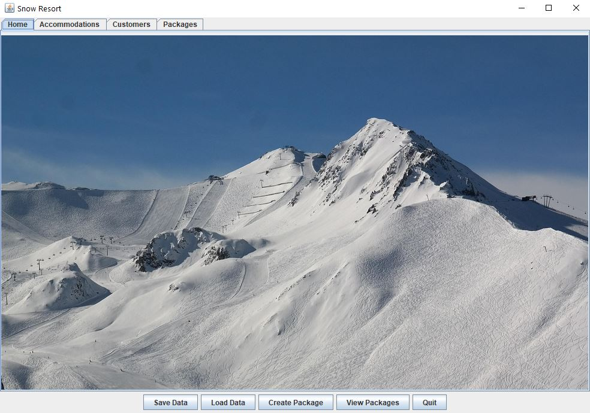
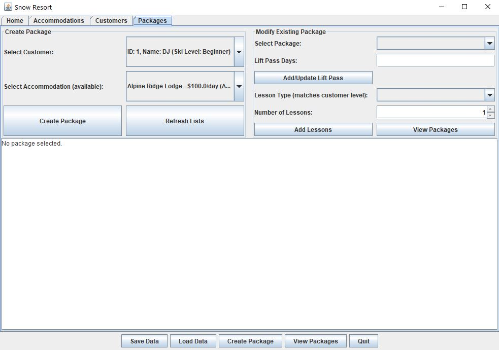

# Snow Resort (Java Swing OOP)

A desktop GUI application for managing ski resort travel packages.

The system allows users to manage customers, accommodations, lift passes, and lesson bookings while enforcing business rules such as ski level validation and accommodation availability.

---

## Screenshots

### Main Interface


### Package Management


---

## Concepts Demonstrated

- Classes & Objects (OOP design)
- Encapsulation (private fields + getters/setters)
- Aggregation (TravelPackage contains Customer, Accommodation, Lessons)
- Event-driven programming (ActionListeners)
- GUI development using Java Swing
- File I/O using Object Serialization
- Data validation & business rule enforcement

---

## Key Features

- Add customers (ski level enforced via dropdown)
- Create travel packages
- Add lift passes separately to packages
- Add lessons with selectable quantity
- Lesson type restricted to customer ski level
- Accommodation marked unavailable when booked
- Save and load system data

---

## Project Structure

- `SnowResort.java` – Core system logic
- `ResortGUI.java` – Main application window
- GUI Tabs – Accommodation, Customer, Package panels
- Model classes – Customer, Accommodation, Lesson, LiftPass, TravelPackage
- `snow.jpg` – GUI background image

---

## How to Run

1. Open the `snow-resort-gui` folder
2. Run:

```bash
ResortGUI.java
